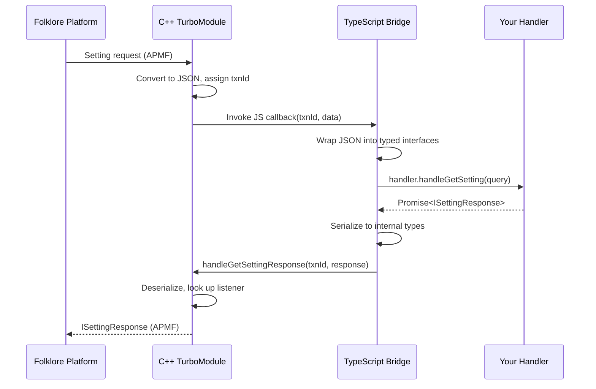

## Request flow

The Device Settings module uses a bidirectional bridge between the Folklore platform's native layer and your TypeScript application code.



## Layer responsibilities

<Tabs>
  <Tab title="TypeScript API">
    The public TypeScript layer (`src/turbo-modules/`) provides:

    - Type-safe interfaces for queries, responses, and results
    - Enum definitions for categories, value types, and status codes
    - Error classes for validation, not-found, and internal failures
    - The `DeviceSettingsServerComponent` factory for server creation
    - Wrapper classes that convert between internal wire types and public getter-based interfaces

    ```typescript
    // Public API uses getter methods
    interface ISettingQuery {
      getKey(): string;
      getCategory(): SettingCategory;
      getMetadataTags(): ISettingMetadata[];
    }
    ```
  </Tab>

  <Tab title="Native Bridge">
    The TurboModule spec (`FolkloreScriptDeviceSettings.ts`) defines the contract between TypeScript and C++:

    - Registered with `TurboModuleRegistry.getEnforcing('FolkloreDeviceSettingsManager')`
    - Exposes handler registration methods that accept callbacks
    - Provides response methods that send data back to native listeners
    - Uses internal flat-property types for JSON serialization

    ```typescript
    // Internal types use plain properties for bridge serialization
    interface IInternalSettingQuery {
      key: string;
      category: SettingCategory;
      metadataTags: IInternalSettingMetadata[];
    }
    ```
  </Tab>

  <Tab title="C++ Implementation">
    The native C++ layer (`folklore/turbo-modules/`) handles:

    - APMF interface integration for platform communication
    - Transaction ID management for async request/response correlation
    - Type conversion between APMF objects and JSON
    - Handler structs that bridge APMF callbacks to JS callbacks
    - Listener maps for routing responses back to the correct requester

    ```cpp
    // Transaction-based async pattern
    uint32_t txnId = m_parent->registerSettingResponseListener(responseListener);
    m_getHandler.invoke(txnId, SettingQueryJsonFromApmf(query));
    ```
  </Tab>
</Tabs>

## Transaction management

The module uses a transaction ID system to correlate asynchronous requests with their responses:

<Steps>
  <Step title="Request arrives">
    The APMF layer calls a handler method with a query/request and a response listener.
  </Step>
  <Step title="Transaction ID assigned">
    The native module generates a unique `uint32_t` transaction ID using an atomic counter and stores the listener in a map keyed by this ID.
  </Step>
  <Step title="JS callback invoked">
    The transaction ID and serialized request data are passed to the JavaScript callback.
  </Step>
  <Step title="Response returned">
    When the TypeScript handler resolves its promise, the bridge calls `handleXxxResponse(txnId, data)` back into native code.
  </Step>
  <Step title="Listener dispatched">
    The native module looks up the listener by transaction ID, deserializes the response, calls the listener, and removes the entry from the map.
  </Step>
</Steps>

## Module registration

The turbo-module is registered with the Folklore runtime via the `AutoLinkInit.cpp` file:

```cpp
extern "C" {
__attribute__((visibility("default"))) void autoLinkFolkloreTurboModulesV1() noexcept {
    FOLKLORE_REGISTER_TURBO_MODULE_WITH_NAME(
        "FolkloreDeviceSettingsManager", FolkloreScriptDeviceSettings);
}
}
```

This makes the module discoverable by `TurboModuleRegistry.getEnforcing('FolkloreDeviceSettingsManager')` on the TypeScript side.
