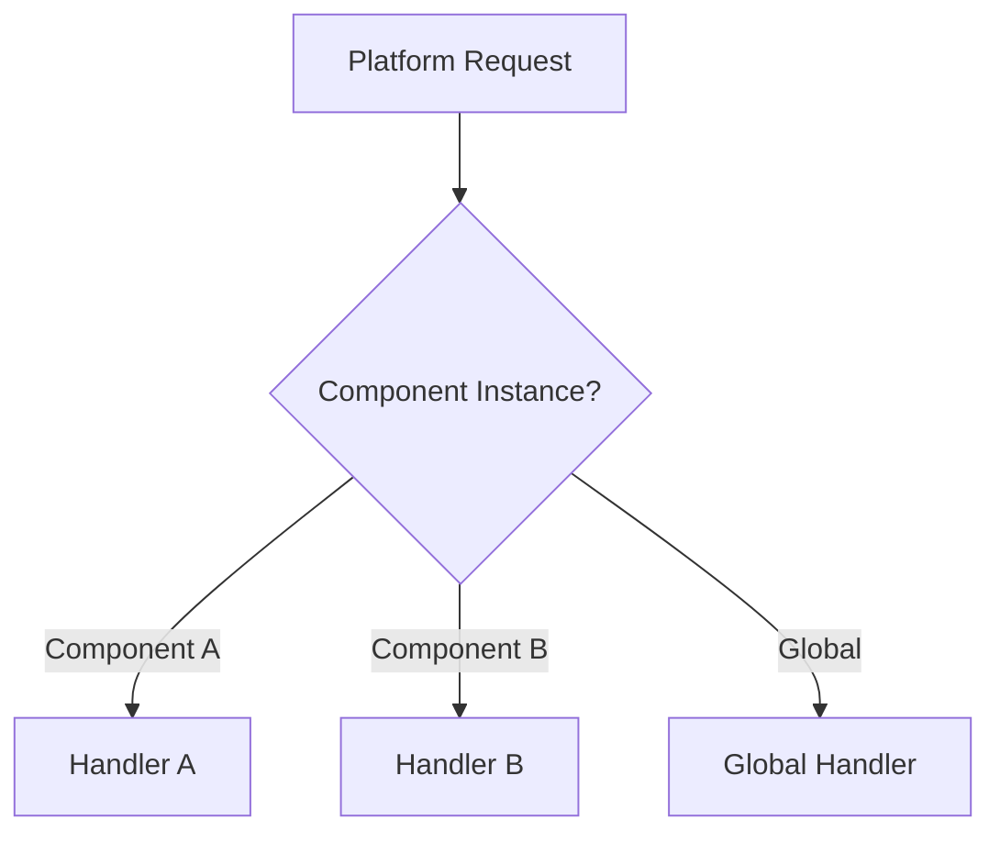

If your application has multiple components that each manage their own settings, you can register handlers per component instance instead of using a single global handler.

## When to use

- Your app has multiple independent components (e.g., a media player and a settings panel)
- Each component manages a different subset of device settings
- You want to isolate setting handling logic per component

## Registration

```typescript
import { IComponentInstance } from '@amzn/react-native-folklore';

const myComponentInstance: IComponentInstance = /* obtained from Folklore runtime */;

server.setHandlerForComponent(handler, myComponentInstance);
```

<Warning>
  The `componentInstance` parameter must not be `null` or `undefined`. Passing an invalid instance throws `SettingsValidationError`.
</Warning>

## How it works

When you call `setHandlerForComponent`, the server registers all three handler callbacks (get, update, list) scoped to the provided component instance via the native turbo-module's `setHandlersForComponent` method.



The platform routes requests to the appropriate handler based on which component the request targets.

## Example

```typescript
import {
  DeviceSettingsServerComponent,
  IDeviceSettingsHandler,
  SettingCategory,
  UpdateResultStatus,
} from '@amzn/folklore-device-settings-manager';
import { IComponentInstance } from '@amzn/react-native-folklore';

const component = new DeviceSettingsServerComponent();
const server = component.getOrMakeServer();

// Handler for the display settings component
const displayHandler: IDeviceSettingsHandler = {
  async handleGetSetting(query) {
    // Only handles DISPLAY category settings
  },
  async handleUpdateSetting(request) {
    return component.makeUpdateResultBuilder()
      .updateStatus(UpdateResultStatus.SUCCESS)
      .build();
  },
  async handleListSettings(category, filter) {
    // Return display-related settings only
    return [];
  },
};

// Handler for the audio settings component
const audioHandler: IDeviceSettingsHandler = {
  async handleGetSetting(query) {
    // Only handles AUDIO category settings
  },
  async handleUpdateSetting(request) {
    return component.makeUpdateResultBuilder()
      .updateStatus(UpdateResultStatus.SUCCESS)
      .build();
  },
  async handleListSettings(category, filter) {
    // Return audio-related settings only
    return [];
  },
};

// Register each handler with its component instance
const displayComponent: IComponentInstance = /* ... */;
const audioComponent: IComponentInstance = /* ... */;

server.setHandlerForComponent(displayHandler, displayComponent);
server.setHandlerForComponent(audioHandler, audioComponent);
```
